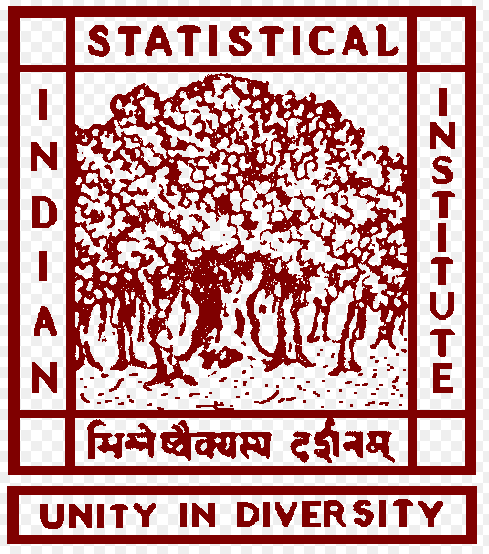
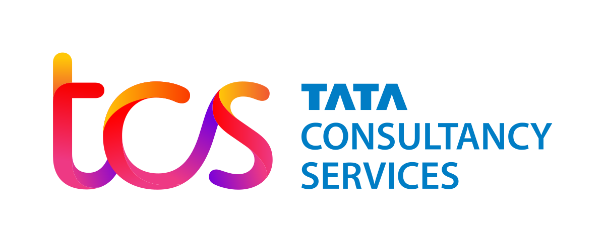
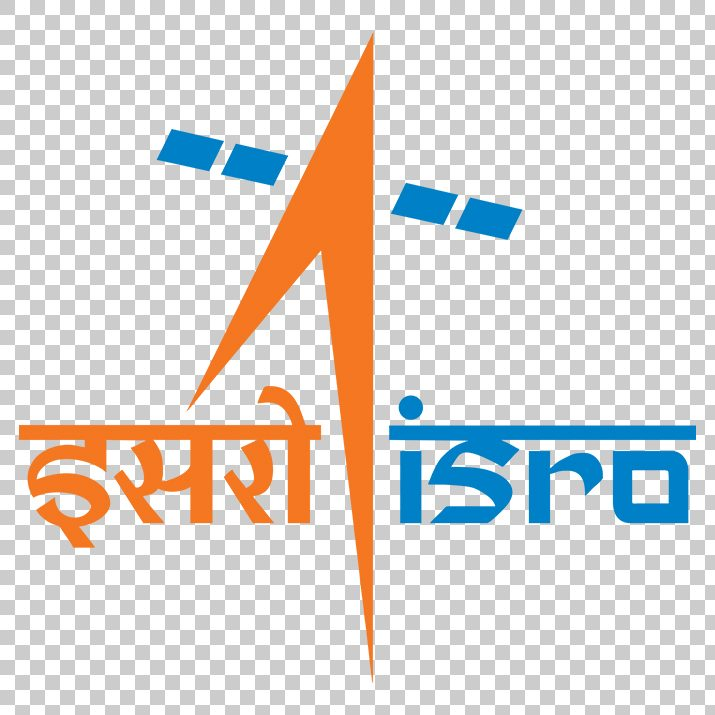

Link to my updated [CV](docs/Archan_Ray_Resume.pdf)

## Education

     

        

            <strong>PhD (CS)</strong> 
            <small>Univ of Massachusetts</small> 
             
            Amherst MA 
            <em>2016-present</em>   
        

     

     

        

            <strong>M.Tech (CS)</strong> 
            <small>Indian Statistical Institute</small> 
             
            Kolkata IN 
            <em>2013-2015</em>   
        

     

     

        

            <strong>B.Tech (CSE)</strong> 
            <small>Jalpaiguri Govt Engg Clg</small> 
             
            Jalpaiguri IN 
            <em>2009-2013</em>   
        

     

## Experience

     

        

            <strong>UMass Amherst</strong> 
            Amherst MA 
             
            Research Assistant 
            <em>2016-present</em>   
        

     

     

        

            <strong>AWS AI Algorithm</strong> 
            New York NY 
             
            Applied Scientist Intern 
            <em>Summers 2019, 2020</em>   
        

     

     

        

            <strong>ISI Kolkata</strong> 
            Kolkata IN 
             
            Visiting Research Scientist 
            <em>2015-2016</em>   
        

     

     

        

            <strong>TCS Innovation Labs</strong> 
            Gurgaon IN 
             
            Applied Research Inter 
            <em>Summer 2015</em>   
        

     

     

        

            <strong>RRSC East, ISRO</strong> 
            Kolkata IN 
             
            Research Intern 
            <em>Summer 2012</em>   
        

     

## Awards

* **Best Dissertation** (M.Tech in Computer Science), Indian Statistical Institute, July 2015

## Service

* I helped organize the weekly [Machine Learning and Friends Lunch](http://ds.cs.umass.edu/mlfl) for a year. Please consider giving a talk!
* I serve as a reviewer for the following:
  * IEEE Transactions on Image Processing
  * NeurIPS 2019 Workshop Sets & Partitions
  * Indian Conference on Computer Vision, Graphics and Image Processing
